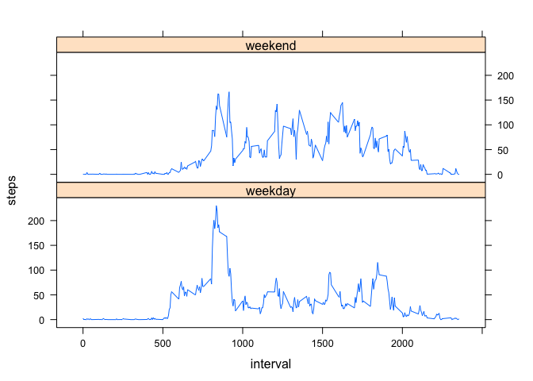

# Reproducible Research: Peer Assessment 1


## Loading and preprocessing the data

```r
      unzip(zipfile='activity.zip')
      activityData <- read.csv('activity.csv', stringsAsFactors = F)

      activityData$date <- as.Date(activityData$date, format = '%Y-%m-%d')  
```

## What is mean total number of steps taken per day?

```r
      stepsPerDay <- aggregate(steps~date,activityData,sum)

      hist(stepsPerDay$steps, freq=T, breaks=10, main = '',
           xlab= 'Total steps per day', col='cornflowerblue')
```

 

```r
      mean(stepsPerDay$steps)
```

```
## [1] 10766.19
```

```r
      median(stepsPerDay$steps)
```

```
## [1] 10765
```

## What is the average daily activity pattern?

```r
      meanByInterval <- aggregate(steps~interval, activityData, mean)
      plot(meanByInterval, type='l', 
           main = 'Average number of steps taken per 5-minute interval, across all days', xlab = '', 
           ylab = 'steps' )
```

 

```r
      with(meanByInterval, interval[which.max(steps)])
```

```
## [1] 835
```

## Imputing missing values

```r
      sum(is.na(activityData$steps))
```

```
## [1] 2304
```

```r
      newActivity <- merge(activityData, meanByInterval, by='interval')
      newActivity$steps.x[is.na(newActivity$steps.x)] <- newActivity$steps.y[is.na(newActivity$steps.x)]
      newActivity <- newActivity[,1:3]
      names(newActivity) <- c('interval','steps','date')

      stepsPerDay <- aggregate(steps~date, newActivity, sum)

      hist(stepsPerDay$steps, freq=T, breaks=15, main = '',
           xlab= 'Total steps per day', col='bisque3')
```

 

```r
      mean(stepsPerDay$steps)
```

```
## [1] 10766.19
```

```r
      median(stepsPerDay$steps)
```

```
## [1] 10766.19
```

## Are there differences in activity patterns between weekdays and weekends?

```r
      newActivity$wd <- rep('weekday')

      for(i in 1:length(newActivity$date)){
            
            if(weekdays(newActivity$date[i]) == "Sunday" | weekdays(newActivity$date[i]) == "Saturday") {
                        newActivity$wd[i] <- ('weekend')
                        }
      }

      wkdMean <- aggregate(steps~interval + wd, newActivity, mean)
      library(lattice)
      xyplot(steps ~ interval | wd, wkdMean, type = 'l', layout = c(1,2))
```

 

